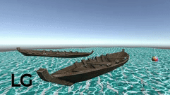
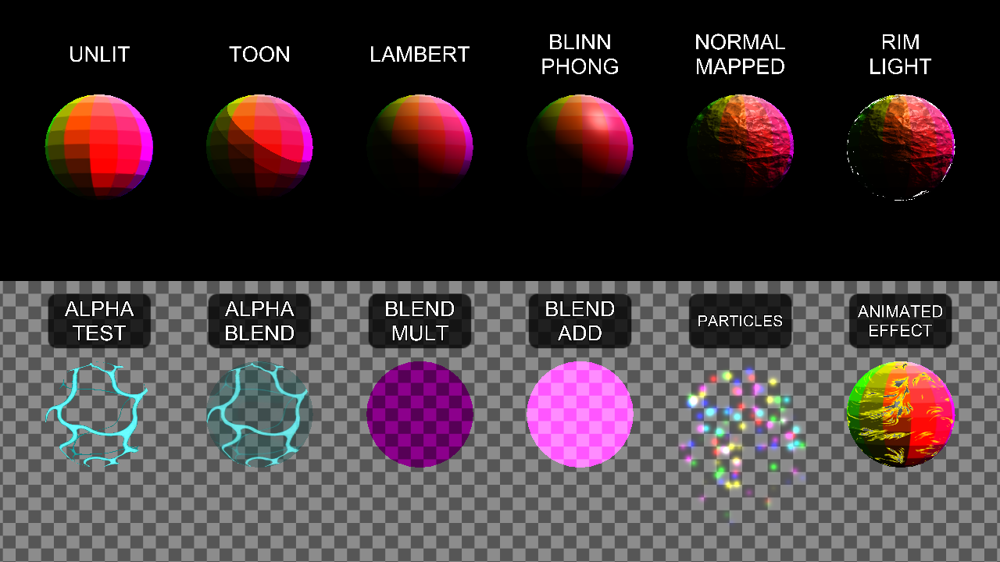

# Unity Shader Learning Repository

Welcome to the **Unity Shader Learning Repository**! This project serves as an instructional guide for those looking to better understand shader programming in Unity. Whether you're new to shaders or aiming to deepen your knowledge, this repository provides hands-on examples and theoretical insights.

## About This Repository

This repository contains:
- A Unity project featuring simple shader implementations.
- Three Markdown documents explaining shader concepts, techniques, and best practices in Unity.

> [!NOTE]  
> Do not take this repository as the best possible approach to shaders, either from a practical or optimization perspective.  
> The goal of this repository is to present shader concepts in the most comprehensible way to help learners understand the core logic behind shader programming.  

## Theory Documentation

For a deeper dive into shader programming, check out the following theory guides:

1. **[Shader Anatomy](Shaders101.md)**  
	Here we explore how a shader is structured, its high-level organization, and the purpose of each block.

2. **[Shader Programs](ShaderPrograms.md)**  
	Covers the basics of shader languages in Unity, focusing on `HLSL` but also mentioning `CG` as a legacy language, and explains how they apply to different rendering pipelines.

3. **[Shader Programming in Scriptable Render Pipelines](SRP.md)**  
	Explores how shader programming evolved along with Unity's Scriptable Render Pipelines (`SRP`), including URP and HDRP.

## Unity Project Contents

Within the Unity project, you'll find:
- **Basic shader implementations** demonstrating fundamental techniques.
- **Examples using ShaderGraph** to illustrate visual shader creation.
- **Handwritten HLSL shaders** showcasing custom solutions for different rendering pipelines.

## Getting Started

To explore the project:
1. Clone the repository:
2. Open the Unity project in Unity (tested on version **6000.0.50f1**).
3. Open the `Sample Scene` and play it in maximized mode for a quick overview.
4. Explore the `Shaders` folder for step-by-step shaders with highly commented code.
5. Read the Markdown documentation for a deeper understanding.
